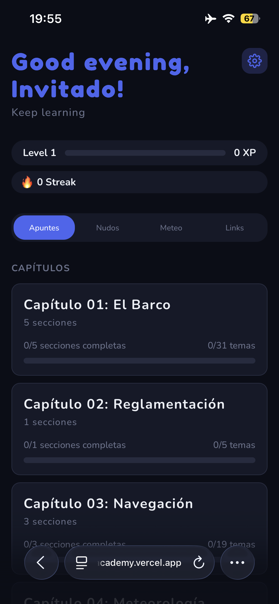
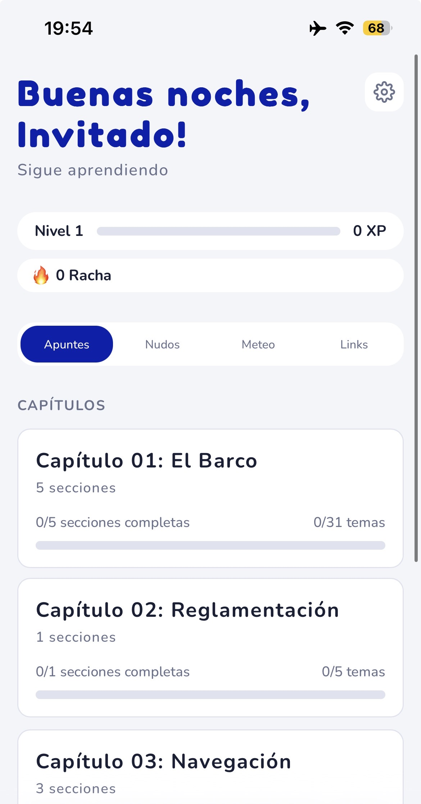
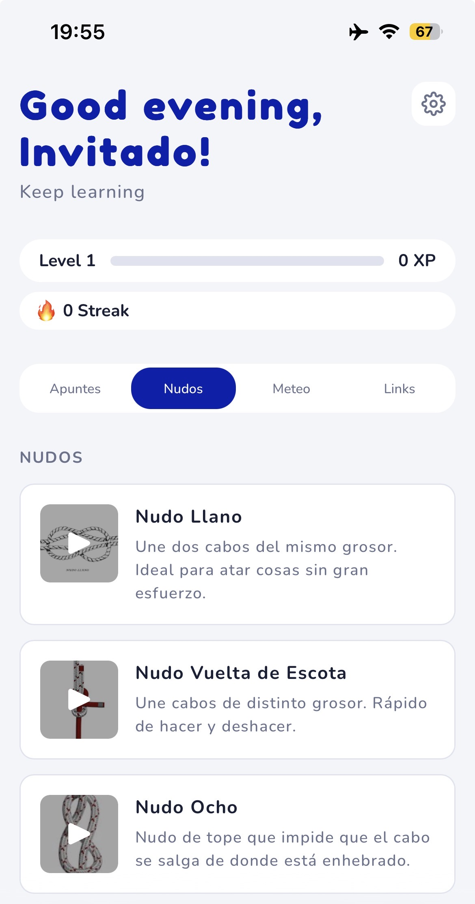
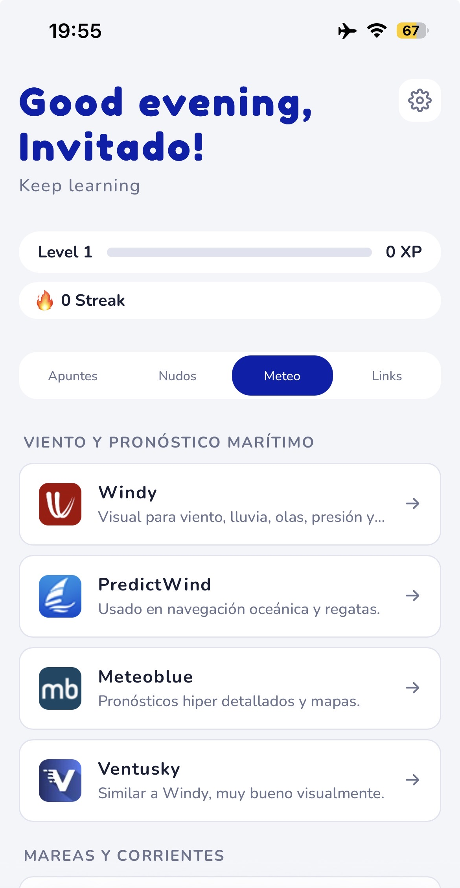
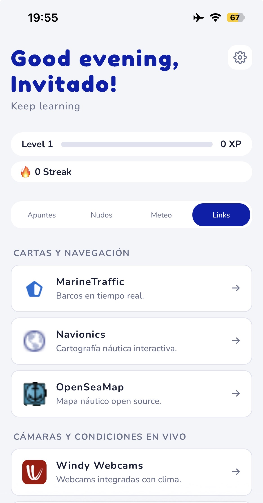
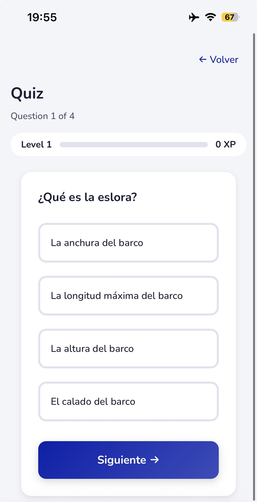
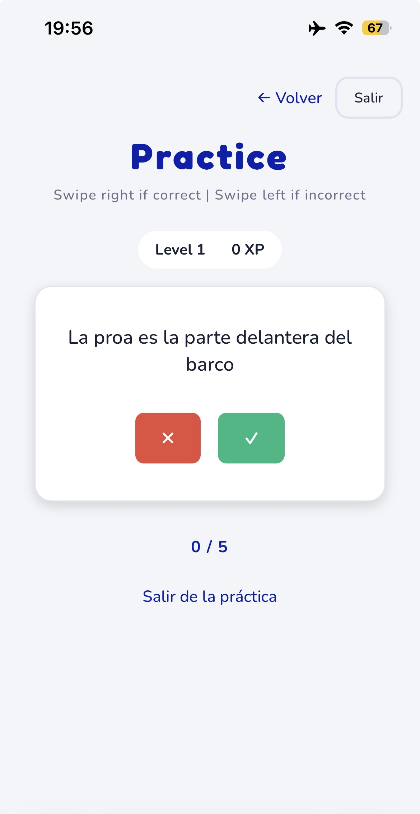

# NAUTICACADEMY


***NauticAcademy is a web application for studying and preparing for the Timonel de Yate de Vela y Motor (Sailing and Motor Yacht Skipper) certification, based on the official program of the Argentine Coast Guard (Prefectura Naval Argentina).***

The app features 6 chapters of structured nautical content with topics, sections, and integrated quizzes to test your knowledge. Progress, XP, and level tracking are persisted locally — no account or internet connection required after loading.

[](https://github.com/ismaelmarot/NauticAcademy/releases)
[](https://github.com/ismaelmarot/NauticAcademy/blob/main/LICENSE)
[](https://github.com/ismaelmarot/NauticAcademy/commits/main)

### Frontend Stack


### Backend Stack


<br>

----------------------------------

## What It Does?

- **Structured Nautical Course**: 6 chapters covering the complete Timonel syllabus
- **Interactive Quizzes**: Test your knowledge after each topic with instant feedback
- **Progress Tracking**: XP, levels, and completed topics saved locally
- **Topic Browser**: Navigate through chapters, sections, and topics with ease
- **Nautical Resources**: Quick-access links to weather services, charts, and ship tracking
- **Knot Library**: Visual guides and 3D references for essential knots
- **PWA Support**: Install as a standalone app on mobile and desktop
- **Offline-Ready**: All content and progress stored locally — no backend required

<br>

----------------------------------

## 🛠️ INFRASTRUCTURE & SERVICES

| Service | Badge | Description |
|---------|-------|-------------|
| **Frontend** |  | React SPA with TypeScript, deployed on Vercel |
| **Styling** |  | CSS-in-JS with styled-components |
| **Storage** |  | All user data persisted in browser localStorage |
| **PWA** |  | Service worker + manifest for installable app |
| **Backend** (future) |  | Express.js API ready for future deployment |

<br>

----------------------------------

## 📑 TABLE OF CONTENT

1. [Highlights](#highlights)
2. [Core Features](#core-features)
3. [Technologies Stack](#technologies-stack)
4. [Installation](#installation)
5. [Usage](#usage)
6. [Project Structure](#project-structure)
7. [Content Structure](#content-structure)
8. [API Endpoints](#api-endpoints)
9. [Database Schema](#database-schema)
10. [Screenshots](#screenshots)
11. [Deployment](#deployment)
12. [License](#license)
13. [Contact](#contact)

<br>

----------------------------------

<a id="highlights"></a>
## 🌟 HIGHLIGHTS

- No login or registration required — app loads instantly as guest
- Full PWA support: installable on any device
- 6 complete chapters based on the Argentine Coast Guard official program
- Integrated quizzes with XP rewards and level progression
- 10+ nautical resource links (weather, charts, traffic, knots)
- Dark/light mode support
- Fully bilingual interface (English/Spanish)
- Offline-capable: all data in localStorage
- Backend ready for future MongoDB + SendGrid deployment

<br>

----------------------------------

<a id="core-features"></a>
## ✨ CORE FEATURES

| Feature | Description |
|---------|-------------|
| Topic Browser | Navigate chapters, sections, and topics with a clean reading interface |
| Quizzes | End-of-topic quizzes with score tracking and XP rewards |
| XP & Leveling | Earn XP for completing topics and quizzes, track your level |
| Progress Tracking | See which topics you've completed at a glance |
| Nautical Resources | Quick links to Windy, Navionics, MarineTraffic, and more |
| Knot Library | Illustrated knot guides with 3D external references |
| Weather Tools | Curated list of weather forecasting services |
| PWA Install | Install as a native app on iOS, Android, and desktop |
| Theme Toggle | Switch between light and dark modes |
| Language Switch | Toggle between English and Spanish |

<br>

----------------------------------

<a id="technologies-stack"></a>
## 🛠️ TECHNOLOGIES STACK

### Frontend

| Category | Library / Tool | Version |
|----------|----------------|---------|
| UI Library | React | ^18.2.0 |
| Language | TypeScript | ^5.0.2 |
| Build Tool | Vite | ^4.4.5 |
| Routing | react-router-dom | ^6.14.0 |
| Styling | styled-components | ^6.0.7 |
| Icons | react-icons | ^5.6.0 |
| PWA | vite-plugin-pwa | ^0.16.4 |
| HTTP Client | axios | ^1.5.0 |
| Swipe Gestures | react-swipeable | ^7.0.0 |

### Backend (ready for future deployment)

| Category | Library / Tool | Version |
|----------|----------------|---------|
| Runtime | Node.js | ^22.0.0 |
| Framework | Express | ^4.18.2 |
| Language | TypeScript | ^5.9.3 |
| Database | SQLite (sqlite3) | ^5.1.6 |
| Auth | JWT (jsonwebtoken) | ^9.0.2 |
| Email | Nodemailer | ^6.10.1 |
| Security | Helmet | ^7.0.0 |
| Validation | express-validator | ^7.0.1 |
| Rate Limiting | express-rate-limit | ^7.1.0 |

<br>

----------------------------------

<a id="installation"></a>
## 🚀 INSTALLATION

### Prerequisites

- Node.js >= 18
- npm or yarn

### 1. Clone the repository

```bash
git clone https://github.com/ismaelmarot/NauticAcademy.git
cd NauticAcademy
```

### 2. Install frontend dependencies

```bash
cd frontend && npm install
```

### 3. Run development mode

```bash
cd frontend && npm run dev
```

The app will be available at `http://localhost:5173`.

### 4. (Optional) Run the backend

```bash
# In a separate terminal
cd backend && npm install && npm run dev
```

<br>

----------------------------------

<a id="usage"></a>
## ⚙️ USAGE

### Getting Started

1. **Open the app** — it loads directly as a guest, no login needed
2. **Browse chapters** from the home page or chapter list
3. **Study topics** within each section of a chapter
4. **Take quizzes** at the end of each topic to test your knowledge
5. **Earn XP** — completing topics and passing quizzes grants experience points
6. **Track your level** — progress is saved automatically in your browser

### Features Overview

- **Home**: Welcome page with quick stats and chapter overview
- **Chapters**: 6 chapters covering the full Timonel syllabus
- **Topic View**: Read content with images and examples
- **Quiz**: Multiple-choice questions with instant scoring
- **Practice**: Review and reinforce key concepts
- **Profile**: View your XP, level, and completed topics
- **Resources**: External links to nautical tools and services

<br>

----------------------------------

<a id="project-structure"></a>
## 📂 PROJECT STRUCTURE

```
NAUTICACADEMY
├── frontend/                       # React + Vite SPA
│   ├── public/
│   │   ├── favicon.svg            # App icon (sail logo)
│   │   ├── manifest.json          # PWA manifest
│   │   └── images/                # Content images and UI assets
│   │       ├── content/timonel/   # Chapter illustrations
│   │       └── ui/                # UI graphics
│   ├── src/
│   │   ├── api/                   # API layer (localStorage adapter)
│   │   │   ├── index.ts
│   │   │   └── progress.ts        # Progress, XP, quiz results
│   │   ├── constants/             # Icons, links, knots, meteo resources
│   │   ├── content/
│   │   │   ├── types.ts           # Content type definitions
│   │   │   └── structured/
│   │   │       └── timonel/       # 6 chapters of nautical content
│   │   ├── context/
│   │   │   └── AuthContext.tsx     # Guest user + localStorage persistence
│   │   ├── pages/                 # Route pages
│   │   │   ├── Home/
│   │   │   ├── Chapter/
│   │   │   ├── Section/
│   │   │   ├── Topic/
│   │   │   ├── Quiz/
│   │   │   ├── Practice/
│   │   │   └── Profile/
│   │   ├── main.tsx               # App entry with routing
│   │   └── vite-env.d.ts
│   ├── vercel.json                # SPA rewrites for Vercel
│   └── package.json
│
├── backend/                        # Express API (ready for future)
│   ├── src/
│   │   ├── index.ts               # Express app entry
│   │   ├── routes/                # Auth, progress, user routes
│   │   └── middleware/            # JWT, validation middleware
│   ├── nauticacademy.db           # SQLite database (dev)
│   ├── .env.example               # Environment config template
│   ├── tsconfig.json
│   └── package.json
│
├── MyIdea/                         # Original source material
│   └── content/structured/
│       └── index.md               # Full course manual (10th edition)
│
├── AGENTS.md                       # Development workflow notes
├── README.md
├── LICENSE
└── package.json
```

<br>

----------------------------------

<a id="content-structure"></a>
## 📖 CONTENT STRUCTURE

The course follows the official **Prefectura Naval Argentina** syllabus for **Timonel de Yate de Vela y Motor**, based on the 10th edition of the physical manual from the **Escuela de Náutica del Club de Veleros Piedrabuena**.

| Chapter | Title | Sections |
|---------|-------|----------|
| 01 | El Barco | Concepts, Cabuyería, Sails, Mechanics, Maneuvers |
| 02 | — | — |
| 03 | — | — |
| 04 | — | — |
| 05 | — | — |
| 06 | — | — |

Each section contains multiple topics with illustrated content and end-of-topic quizzes.

<br>

----------------------------------

<a id="api-endpoints"></a>
## 🔌 API ENDPOINTS

The backend is currently **not deployed**. These endpoints are ready for future deployment with MongoDB + SendGrid.

### Auth

| Method | Endpoint | Description |
|--------|----------|-------------|
| POST | /api/auth/register | Register a new user |
| POST | /api/auth/login | Login and receive JWT |
| POST | /api/auth/forgot-password | Request password reset email |
| POST | /api/auth/reset-password | Reset password with token |
| GET | /api/auth/verify-email/:token | Verify email address |

### User

| Method | Endpoint | Description |
|--------|----------|-------------|
| GET | /api/user/me | Get current user profile |

### Progress

| Method | Endpoint | Description |
|--------|----------|-------------|
| GET | /api/progress | Get user progress (topics, XP, level) |
| POST | /api/progress/topic/:id | Mark topic as completed |
| POST | /api/progress/quiz | Submit quiz result |

> **Note:** In the current frontend-only deployment, all these endpoints are handled locally via `localStorage`.

<br>

----------------------------------

<a id="database-schema"></a>
## 💾 DATABASE SCHEMA

### User

```json
{
  "id": "INTEGER PRIMARY KEY",
  "firstName": "TEXT",
  "lastName": "TEXT",
  "nickname": "TEXT",
  "email": "TEXT UNIQUE",
  "password": "TEXT (hashed)",
  "emailVerified": "BOOLEAN",
  "xp": "INTEGER DEFAULT 0",
  "level": "INTEGER DEFAULT 1",
  "streak": "INTEGER DEFAULT 0",
  "createdAt": "DATETIME",
  "updatedAt": "DATETIME"
}
```

### Progress

```json
{
  "id": "INTEGER PRIMARY KEY",
  "userId": "INTEGER (FK → User)",
  "topicId": "TEXT",
  "completed": "BOOLEAN",
  "score": "INTEGER",
  "totalQuestions": "INTEGER",
  "completedAt": "DATETIME"
}
```

<br>

----------------------------------

<a id="deployment"></a>
## 🌐 DEPLOYMENT

### Current: Frontend on Vercel

The app is deployed as a static SPA on **Vercel**. The `vercel.json` file handles SPA routing:

```json
{
  "rewrites": [
    { "source": "/(.*)", "destination": "/" }
  ]
}
```

### Future: Backend on Render

The backend is ready to be deployed on **Render** (or any Node.js host) with:
- **MongoDB Atlas** for database (replacing SQLite)
- **SendGrid** for transactional emails
- Environment variables configured via `.env`

<br>

----------------------------------

<a id="screenshots"></a>
## 📸 Screenshots

<p align="center">
  
  
  
</p>

<p align="center">
  
  
  
</p>

<p align="center">
  
</p>

<br>

----------------------------------

<a id="license"></a>
## 📄 LICENSE

This project is licensed under the MIT License — see the [LICENSE](LICENSE) file for details.

<br>

----------------------------------

<a id="contact"></a>
## 📬 CONTACT

Open to collaboration, feedback, and new opportunities.

[](https://github.com/ismaelmarot)
[](https://linkedin.com/in/ismael-marot)
[](https://ismaelmarot.github.io)
